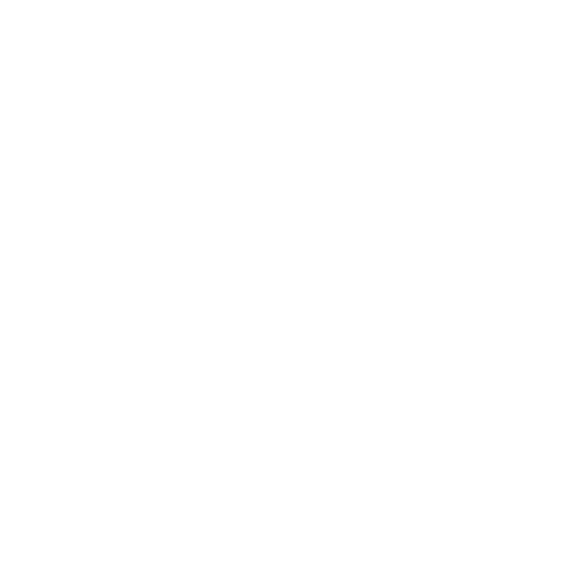

  

<h1 align="center"> Hi, I'm Loai Wael </h1>

MERN stack Dev.

## ABOUT ME:
I'm learning to save the world.  Just kidding, I'm learning to drive any business to be better at its core points, or to bring a new idea to our digital Life  I'm learning to solve real-world problems as a software engineer  
1- Get an idea 
2- Planning & Prototyping 
3- Vibe coding 

 
  

## SOCIAL:
    

## TECH STACK:

### Main tech:
         

### Tools:
   

### Additional tech:
         
